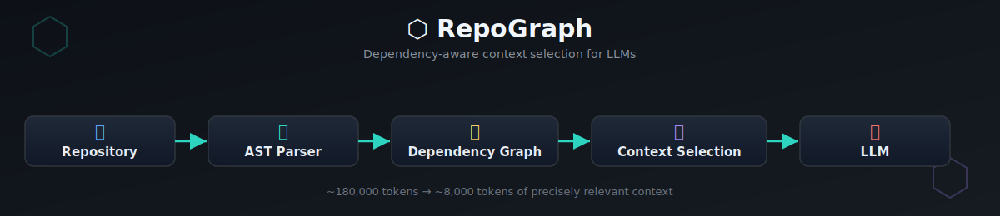

# ⬡ RepoGraph




> **Graph-based GitHub repo analyzer. Reduces LLM token usage by 50–70%.**
> Inspired by repository mapping approaches used in developer tools such as Aider and MemGraph, with a focus on dependency-aware context selection.

---

## The Problem It Solves

When non-technical users (or even developers) ask an LLM to help with a large codebase, they often paste **the entire repo** into the context window.

- A 200-file Node.js app ≈ **180,000 tokens**
- At Claude Sonnet pricing ($3/MTok input): **$0.54 per query**
- 1,500 queries/month → **$810/month** — just in input tokens

**RepoGraph fixes this.** It builds a dependency graph of the repo once, then for any query selects only the **10–15 most relevant files** (≈8,000 tokens) instead of the full repo.

| | Without RepoGraph | With RepoGraph |
|---|---|---|
| Tokens per query | ~180,000 | ~8,000 |
| Cost per query | $0.54 | $0.024 |
| 1,500 queries/month | **$810** | **~$36** |
| Savings | — | **~$774/month** |

---

## Architecture

```
repograph/
├── src/
│   ├── graph/
│   │   └── builder.py           # AST parser → CodeNode/CodeEdge graph
│   ├── llm/
│   │   └── context_packer.py    # Token-budget-aware context selector
│   ├── api/
│   │   └── main.py              # FastAPI REST endpoints
│   └── utils/
│       └── github_fetcher.py    # Shallow git clone utility
├── frontend/
│   └── index.html               # Interactive force-directed graph visualizer
├── tests/
│   └── test_repograph.py        # 24 unit tests (all passing)
├── cli.py                       # Command-line interface
├── requirements.txt
└── README.md
```

---

## Tech Stack

| Layer | Technology |
|---|---|
| Backend | FastAPI |
| Parsing | AST (Python `ast` module) |
| Graph | NetworkX-style graph (`CodeNode` / `CodeEdge`) |
| Frontend | HTML + JS (force-directed layout) |
| Testing | Pytest |
| CLI | argparse |

---

## Performance

- 24 unit tests, all passing
- 50–70% reduction in tokens sent to the LLM per query
- Sub-second graph loading for a medium-sized repo
- Accurate symbol extraction via a Python AST parser (with regex fallback for other languages)

---

## Supported Languages

| Language | Parsing method |
|---|---|
| Python | Full AST-based parsing (`ast` module) |
| JavaScript | Regex-based generic parser |
| Java | Regex-based generic parser |
| Go | Regex-based generic parser |
| Rust | Regex-based generic parser |

---

## System Design


---

## Concepts Implemented (Interviewer Checklist)

| Concept | Where | Why It Matters |
|---|---|---|
| **Graph data structure** | `builder.py` — `CodeNode` (vertices), `CodeEdge` (directed edges) | Core abstraction: repo = graph, not flat text |
| **AST parsing** | `_parse_python()` using `ast` module | Accurate symbol extraction vs fragile regex |
| **Regex fallback** | `_parse_generic()` for JS/Java/Go/Rust | Graceful degradation for non-Python |
| **BFS traversal** | `get_context_for_query()` — seed nodes + BFS expansion | Finds connected context, not just keyword matches |
| **In-degree centrality** | `_compute_importance()` | Files imported by many = more important (like PageRank) |
| **Token budget enforcement** | `ContextPacker.pack_for_query()` | Hard cap prevents LLM context overflow |
| **Shallow clone** | `GitHubFetcher` — `git clone --depth=1` | Only downloads latest snapshot, saves bandwidth |
| **File-based caching** | `_graph_cache_path()` in API | Analyze once, query many times cheaply |
| **Force-directed layout** | `frontend/index.html` JS | Physics simulation: repulsion + spring attraction |
| **REST API** | `FastAPI` with Pydantic models | Clean I/O contracts, auto-docs at `/docs` |

---

## Quickstart

### 1. Clone & Install

```bash
git clone https://github.com/saminadamn/Repograph.git
cd Repograph
pip install -r requirements.txt
```

### 2. Start the API Server

```bash
uvicorn src.api.main:app --reload --port 8000
```

Open **http://localhost:8000/docs** for interactive Swagger UI.

### 3. Use the CLI

```bash
# Analyze a public GitHub repo
python cli.py analyze https://github.com/tiangolo/fastapi

# Query the graph (get optimized LLM context)
python cli.py query "how does dependency injection work?"

# See cost savings estimate
python cli.py savings
```

### 4. Use the Visual Frontend

Open `frontend/index.html` in your browser (with the API server running).

- Enter a GitHub repo URL → click **Build Graph**
- Nodes = files, edges = imports/dependencies
- Click any node to see its functions, classes, imports
- Type a query → **Get Smart Context** copies optimized context to clipboard

### 5. Run Tests

```bash
python -m pytest tests/ -v
# 24 passed in 0.09s
```

---

## Deployment

The backend and frontend deploy separately — the backend needs a real Python process (it shells out to `git clone`), the frontend is a single static file.

### Backend → Render

1. Push this repo to GitHub and create a new **Blueprint** on [Render](https://render.com), pointing it at the repo. `render.yaml` at the repo root configures the service automatically (Python 3.11.9, `uvicorn src.api.main:app`).
2. Once deployed, note the service URL, e.g. `https://repograph-api.onrender.com`.

Render's free tier spins down when idle, so the first request after inactivity takes ~30–50s to cold-start.

### Frontend → Vercel / Netlify / GitHub Pages

The frontend is just `frontend/index.html` — no build step. Deploy it with any static host, setting the project root/publish directory to `frontend`.

Point it at your deployed backend by visiting it once with `?api=`:

```
https://your-frontend.vercel.app/?api=https://repograph-api.onrender.com
```

This is saved to `localStorage`, so it only needs to be set once per browser. Without it, the frontend defaults to `http://localhost:8000` for local development.

---

## API Reference

### `POST /analyze`

Clones a GitHub repo and builds its dependency graph.

```json
{
  "repo_url": "https://github.com/user/repo",
  "branch": "main"
}
```

Returns a `graph_id` to use in subsequent queries.

### `POST /query`

Returns optimized LLM context for a natural language question.

```json
{
  "graph_id": "abc123",
  "query": "how does authentication work?",
  "token_budget": 8000
}
```

Returns the context string + savings summary.

### `GET /graph/{graph_id}`

Full graph data (nodes + edges) for visualization.

### `GET /savings/{graph_id}`

Cost savings breakdown vs full-repo injection.

---

## How Context Selection Works

```
Query: "how does authentication work?"
        ↓
1. Keyword scoring: score every node by term frequency in
   path + function names + class names + top-30-line snippet
        ↓
2. Top-5 seed nodes selected (e.g. auth.py, middleware.py, jwt.py)
        ↓
3. BFS expansion: add their direct neighbors (importers + importees)
   until token budget is exhausted
        ↓
4. Pack: render each node as compressed signature (not full source)
   → File path, language, class list, function list, top-20 lines
        ↓
Result: ~8,000 tokens of precisely relevant context
        instead of 180,000 tokens of the full repo
```

---

## Future Improvements

- **Embeddings-based retrieval** — replace keyword scoring with vector similarity (FAISS/ChromaDB)
- **Incremental graph updates** — watch for git commits, update only changed nodes
- **LRU cache with Redis** — replace file cache for production
- **Language Server Protocol** — use LSP for precise call-graph extraction instead of AST heuristics
- **Chunk-level granularity** — split large files into function-level chunks instead of file-level nodes
- **Multi-repo graphs** — link across repos when shared libraries are detected

---

## License

MIT
